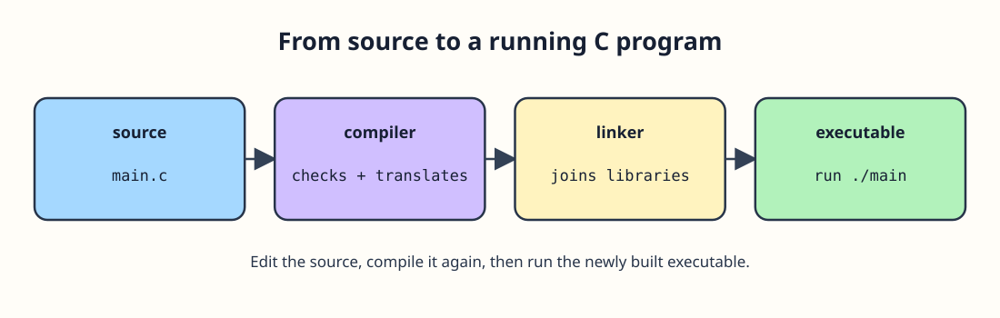

# From source file to running program

Write your C instructions in a text file such as `main.c`. The compiler checks the source and translates it into object code. The linker combines that object code with the library code it needs to make an executable. Running the executable starts the program. If you edit `main.c`, you must build again; the old executable does not change on its own.

With GCC, `gcc -std=c11 -Wall -Wextra main.c -o main` compiles and links the file. On a Unix-like terminal, `./main` runs it; on Windows, use the executable's name. A missing semicolon can stop compilation. A program that compiles but prints the wrong donation count has a different problem: its instructions are valid C, but the logic needs fixing.

Follow the workshop sign through the diagram. A missing semicolon shows up at compilation; an incorrect starting count may not become obvious until you run the program.
