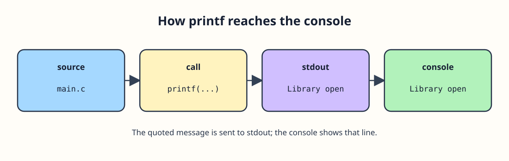

# A message from C




The library needs a short shelf message. Start at `main`: that is where this C program runs. The braces hold its statements, and each statement ends with a semicolon. `#include <stdio.h>` makes the declaration of `printf` available. Inside a printed string, `\n` starts a new line.

`int main(void)` takes no arguments and returns an integer exit status; `return 0;` reports success. `printf` sends the quoted string to standard output. Run this complete program. Then give the shelf a different message and run it again:

```c run
#include <stdio.h>

int main(void) {
    printf("Library open\n");
    return 0;
}
```

The quoted text is data, not a C instruction. Two `printf` calls appear below; watch their order:

```c run
#include <stdio.h>

int main(void) {
    printf("Shelf A\n");
    printf("Shelf B\n");
    return 0;
}
```

Remove the first `\n` for a run. Does `Shelf B` still begin on its own line? Put it back afterward.

## Running a C file

Save the whole example as `main.c` if you want to try it locally. With GCC, run `gcc -std=c11 -Wall -Wextra main.c -o main`, then `./main` (on Windows, run the resulting executable instead). The compiler checks the source first and produces an executable only if compilation succeeds. The site's Run button does both steps when its C runner is available.

Remove the semicolon after `printf` once and read the compiler error. A comment such as `/* shelf label */` is ignored; a missing semicolon is not. Restore it before moving on.
