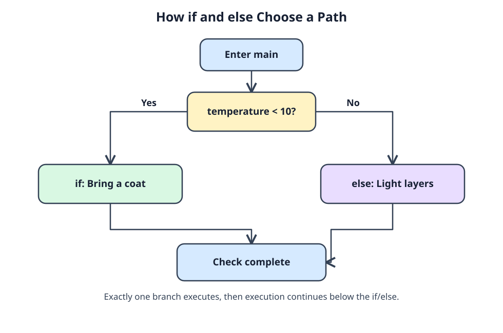

# One reminder, two paths

The garden club prints one clothing reminder for the current temperature. C evaluates the `if` condition once. A true result runs its block; a false result runs the `else` block. After either one, execution continues below the whole `if`/`else`. You will never see both clothing reminders in a single run.



In the diagram, follow `Yes` when `temperature < 10` and `No` otherwise. Both paths reach `printf("Check complete\n")`. Braces hold each branch's statements together. At 8 degrees, the program takes the first path:

```c run
#include <stdio.h>

int main(void) {
    int temperature = 8;
    if (temperature < 10) {
        printf("Bring a coat\n");
    } else {
        printf("Light layers are fine\n");
    }
    printf("Check complete\n");
    return 0;
}
```

Change `temperature` to `16`. The clothing message changes, but `Check complete` still prints. More than two choices need an `else if`, checked only when the preceding condition failed:

```c run
#include <stdio.h>

int main(void) {
    int temperature = 16;
    if (temperature < 10) {
        printf("Cold\n");
    } else if (temperature < 20) {
        printf("Mild\n");
    } else {
        printf("Warm\n");
    }
    return 0;
}
```

Only the first matching branch runs. Try 9, 10, 19, and 20: you should get Cold, Mild, Mild, and Warm. Those boundary values catch mistakes that a comfortable middle value might miss. Keep braces even for one-statement branches; if you add another statement later, it should stay in the intended branch. A statement meant for every path belongs after the entire chain.
