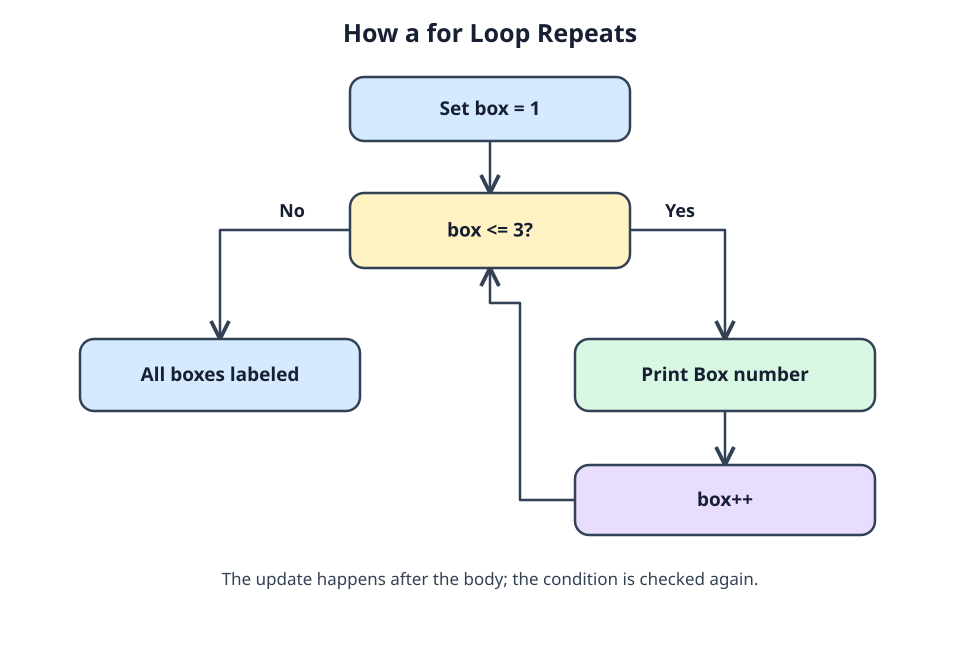

# Label the boxes with a loop

Three boxes need labels. You could write three `printf` calls, but a `for` loop keeps the changing number in one place. In `for (int box = 1; box <= 3; box++)`, C initializes `box` once, checks the condition before each pass, runs the body when it is true, and increments afterward. `box++` adds one. When the condition fails, execution continues after the loop.



Trace the arrows with `box = 1`: print 1, then update to 2. The same happens for 2 and 3. At 4, `4 <= 3` is false, so nothing else prints from the loop. Without an update, a condition that stays true can keep the program running forever.

Run the box labels and check where the final message appears:

```c run
#include <stdio.h>

int main(void) {
    for (int box = 1; box <= 3; box++) {
        printf("Box %d\n", box);
    }
    printf("All boxes labeled\n");
    return 0;
}
```

Set the upper limit to `2` and count the box lines. For a running total, keep a variable outside the loop and update it inside:

```c run
#include <stdio.h>

int main(void) {
    int sum = 0;
    for (int number = 1; number <= 4; number++) {
        sum = sum + number;
    }
    printf("Sum: %d\n", sum);
    return 0;
}
```

`sum` starts at zero, then keeps its previous value between passes. Trace it: as `number` goes 1, 2, 3, 4, `sum` becomes 1, 3, 6, 10.

## Three passes, two starting points

Labels 1 through 3 use `box <= 3`. Array indexes for three elements are 0 through 2, so they use `i < 3`. Both loops run three times; the starting values differ. Keep that distinction in mind for the accumulator exercise.
