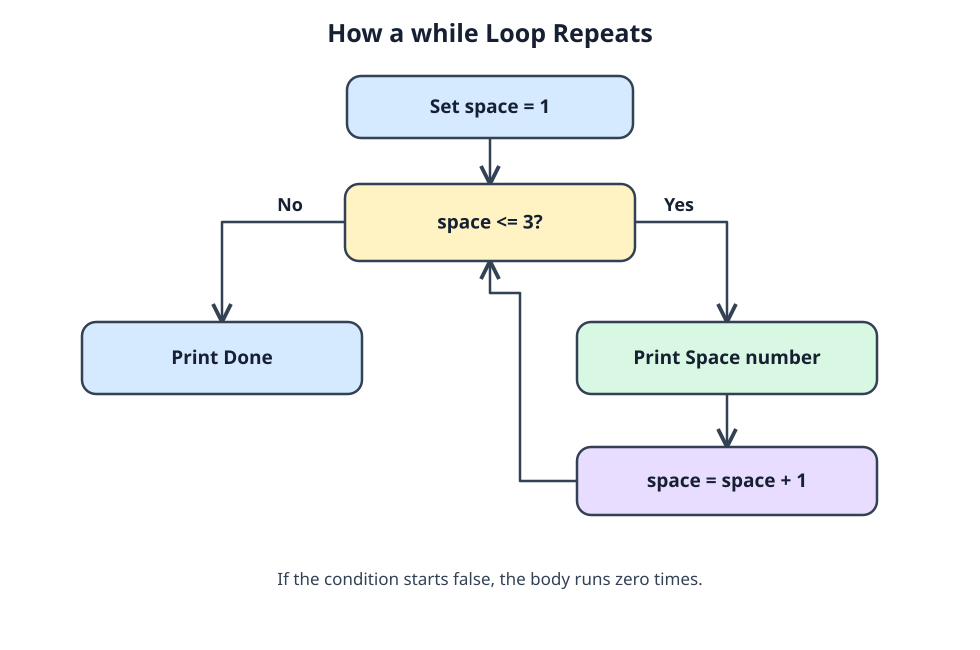

# Keep going until the limit

The program needs to print each available space until it reaches the limit. A `while` loop checks its condition before every pass, so a false starting condition skips the body entirely. Compared with `for`, the setup usually sits before the loop and the update inside it. This form is handy when the stopping condition matters more than a fixed number of passes.



In the diagram, a count of 0 passes `count < 3`; at 3, the condition fails. Look for the statement that changes the count, or the loop might never stop.

Run the space labels:

```c run
#include <stdio.h>

int main(void) {
    int space = 1;
    while (space <= 3) {
        printf("Space %d\n", space);
        space = space + 1;
    }
    printf("Done\n");
    return 0;
}
```

Start `space` at `4` for one run. The body is skipped; only `Done` appears. A loop can also jump by more than one each time. This one doubles its width:

```c run
#include <stdio.h>

int main(void) {
    int width = 2;
    while (width < 10) {
        printf("Width: %d\n", width);
        width = width * 2;
    }
    printf("Width limit reached\n");
    return 0;
}
```

The checks see 2, 4, 8, and 16. Only the first three print: 16 fails `width < 10`. Before writing a new `while` loop, identify both its stop condition and the update that moves toward it. The countdown exercise uses a decreasing value instead.
