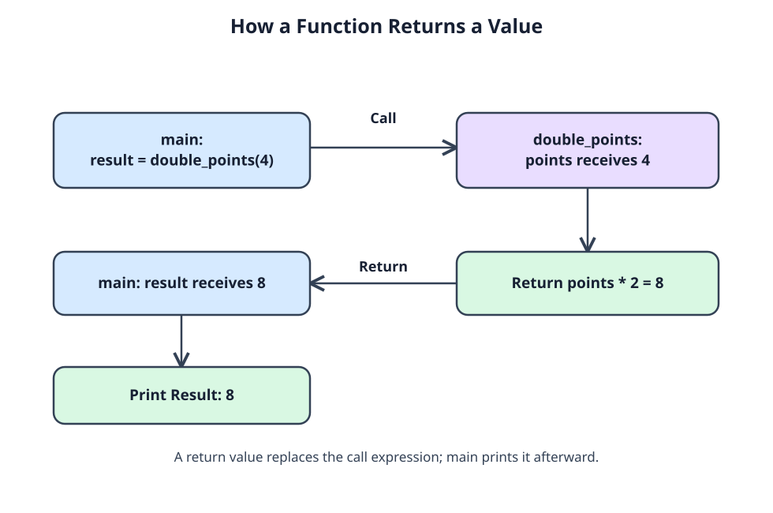

# Send a value back to main

A points calculator can give a value back to its caller. When `main` reaches `double_points(4)`, the call passes 4 into `points`. The function computes 8 and returns it; `main` uses that value to initialize `result`, then continues. A returned value does not print by itself.



Follow the diagram from `main` into `double_points` with argument 4, then back with 8. `points` belongs to the called function; `result` belongs to `main`. The `return` ends this call, and `main` picks up where it left off.

Start reading at `main` and predict the line it prints:

```c run
#include <stdio.h>

int double_points(int points) {
    int doubled = points * 2;
    return doubled;
}

int main(void) {
    int result = double_points(4);
    printf("Result: %d\n", result);
    return 0;
}
```

Try `double_points(6)` and check the printed result. You can also use a returned value directly in a larger expression:

```c run
#include <stdio.h>

int add_fee(int amount) {
    return amount + 2;
}

int main(void) {
    int bill = add_fee(5) * 2;
    printf("Bill: %d\n", bill);
    return 0;
}
```

`add_fee(5)` yields 7, then multiplication makes `bill` 14. For the earlier example, you can trace the same handoff: `main` waits at `double_points(4)` while `points` becomes 4 and `doubled` becomes 8; `return doubled;` gives 8 back. `return 0;` in `main` reports an exit status instead. Neither return displays anything. That job belongs to `printf`.
