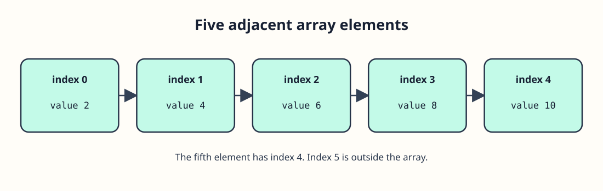

# Count the bins before indexing




There are five screw counts in this array, at indexes 0 through 4. Index 5 is outside it, and C will not check for you. To find the count without repeating the number 5, divide the size of the whole local array by the size of one element. The result is a `size_t` value, which `printf` displays with `%zu`.

```c run
#include <stdio.h>

int main(void) {
    int screws[] = {2, 4, 6, 8, 10};
    size_t count = sizeof screws / sizeof screws[0];
    printf("Bins: %zu\n", count);
    printf("Last bin: %d\n", screws[count - 1]);
    return 0;
}
```

`count - 1` is the last valid index here because the array is nonempty. Try removing two initial values and running the code again; both printed values should change. This calculation works while `screws` is an array in the current scope. A function receiving it as a parameter needs the count passed separately.
