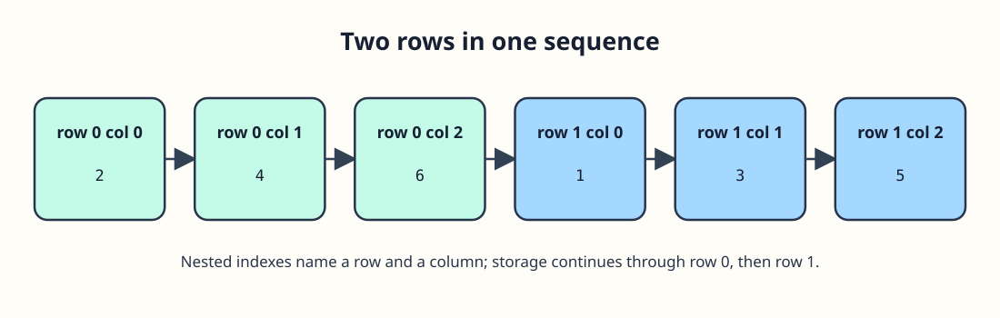

# A cabinet with rows and columns




Picture two shelves with three bins each. `int bins[2][3]` has two rows, and each row holds three integers. `bins[1][2]` is the last bin on the second shelf. In memory, C lays out all of row 0 before row 1. Valid row indexes are 0 and 1; valid column indexes are 0, 1, and 2.

```c run
#include <stdio.h>

int main(void) {
    int bins[2][3] = {{2, 4, 6}, {1, 3, 5}};
    for (int row = 0; row < 2; row++) {
        for (int column = 0; column < 3; column++) {
            printf("%d ", bins[row][column]);
        }
        printf("\n");
    }
    return 0;
}
```

Before running, trace row 0: it prints 2, 4, 6. The inner loop finishes, `printf("\n")` ends the line, and the outer loop moves to row 1. Keep each loop bound matched to its dimension; mixing them up can take an index outside the array.
