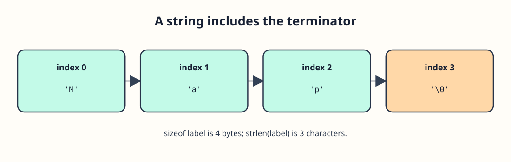

# C Strings and the Null Terminator




A C string needs one extra element after its visible characters. The array holding `"Ada"` contains `'A'`, `'d'`, `'a'`, and `\0`. The final null character tells `%s` where the string ends. Use `%c` for one character and `%s` for the entire terminated string. `strlen` from `<string.h>` reports 3 because it does not count `\0`.

The examples create their own arrays with enough space for the closing `\0`.

Print a whole string and one character from it:

```c run
#include <stdio.h>

int main(void) {
    char label[] = "Map";
    printf("Label: %s\n", label);
    printf("First: %c\n", label[0]);
    return 0;
}
```

`label[3]` is the null terminator, not a printable fourth letter.

## Capacity versus visible length

`char name[4] = "Ada"` leaves room for the terminator. `char name[3] = "Ada"` does not, so printing that array with `%s` would be unsafe. Do not call `strlen` on an unterminated character array either. When counting a label in the exercise, give it room for `\0` first.
