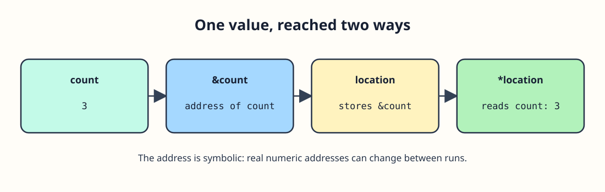

# Pointers: Addresses and Dereferencing




`int *location = &count;` gives `location` the address of `count`. The `*` in the declaration makes this an `int` pointer; later, `*location` means the integer at that address. Reading or assigning through it reaches `count` itself, not a separate copy. Always initialize a pointer before dereferencing it; an uninitialized pointer does not identify an object you can use.

The first print reads through the pointer. The assignment through `*location` changes `count`, so the second print sees the new value.

Use an initialized pointer to update the original value:

```c run
#include <stdio.h>

int main(void) {
    int count = 3;
    int *location = &count;
    printf("Before: %d\n", *location);
    *location = 5;
    printf("After: %d\n", count);
    return 0;
}
```

The pointer and `count` refer to the same integer storage. `*location` is not a new variable.

## Address, pointee, and lifetime

The diagram shows `&count` rather than a numeric address because the address can differ between runs. At each dereference, `location` must still point to a live `int`. Making up a numeric address does not make a usable pointer.
