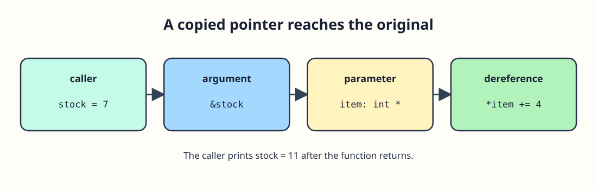

# Fix a stock count through its address




An inventory correction needs to change the count held in `main`. Passing an `int` alone would give the function a copy. Passing `&stock` copies its address instead, and `*item` then refers to the original `stock`. The pointer parameter is a copy, but the integer it points to is shared for the duration of the call.

```c run
#include <stdio.h>

void correct_count(int *item) {
    *item += 4;
}

int main(void) {
    int stock = 7;
    correct_count(&stock);
    printf("Stock: %d\n", stock);
    return 0;
}
```

Trace the call: `stock` is 7, `item` points to it, `*item` becomes 11, then `main` prints 11. Change 4 to 2 and predict the output. In the exercise, you will use two addresses to exchange counts instead of adding to one.
