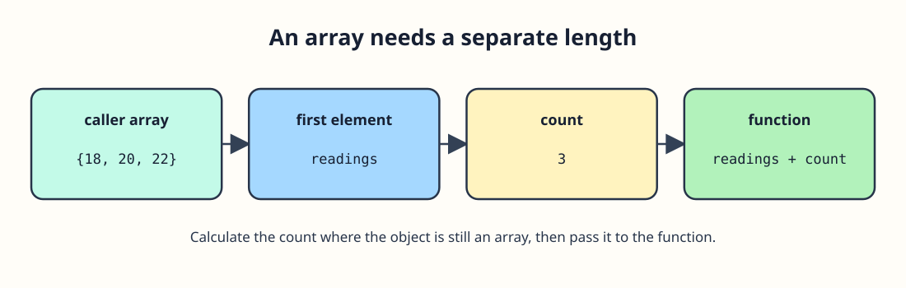

# Pass the readings with their count




The desk has three readings to pass to a function. In a parameter list, `const int readings[]` is adjusted to a pointer to the first element. That pointer does not carry the array's length, and `sizeof readings` inside the function measures the pointer rather than the whole array. Pass the element count separately. The `const` qualifier prevents writes through this parameter.

```c run
#include <stdio.h>

int first_reading(const int readings[], size_t count) {
    if (count == 0) {
        return 0;
    }
    return readings[0];
}

int main(void) {
    int readings[] = {18, 20, 22};
    size_t count = sizeof readings / sizeof readings[0];
    printf("First: %d\n", first_reading(readings, count));
    return 0;
}
```

`sizeof` counts elements in `main`, where `readings` is an array. It would not do that inside `first_reading`. Change the first value and predict the output. The next exercise uses the count to visit every element without reading past the end.
