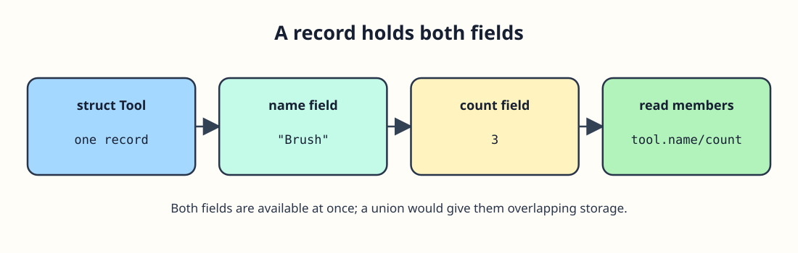

# Define a Supply Record



At the workshop, a brush has a name and a count. A `struct` keeps those two pieces of information in one record. The declaration ends with a semicolon; the initializer fills members in their declared order, and `.` reads them.

```c run
#include <stdio.h>
struct Tool { const char *name; int count; };
int main(void) {
    struct Tool tool = {"Brush", 3};
    printf("%s: %d\n", tool.name, tool.count);
    return 0;
}
```

Run this with three brushes, then change the count to 4. The label should change from `Brush: 3` to `Brush: 4` without touching the name.
