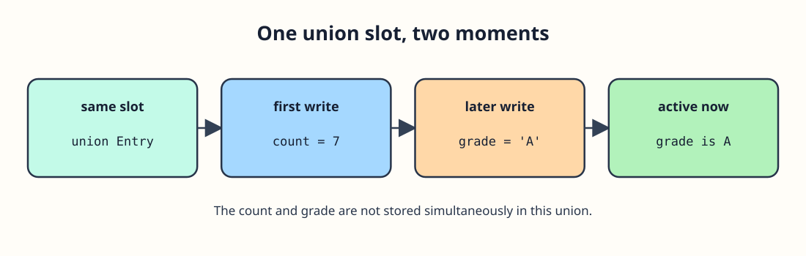

# One storage space, two possible values



The workshop's old counter sometimes records a number, sometimes a letter. A `struct` has room for both fields at once; a `union` makes them share storage. Treat the member you most recently stored as the value to read. The example prints `count` while that member holds 7, then switches to `grade`.

```c run
#include <stdio.h>

union Entry {
    int count;
    char grade;
};

int main(void) {
    union Entry entry = {.count = 7};
    printf("Count: %d\n", entry.count);
    entry.grade = 'A';
    printf("Grade: %c\n", entry.grade);
    return 0;
}
```
Find the assignment that switches the stored member from `count` to `grade`. After that write, you cannot expect `entry.count` still to hold seven: the two members occupy overlapping storage.
