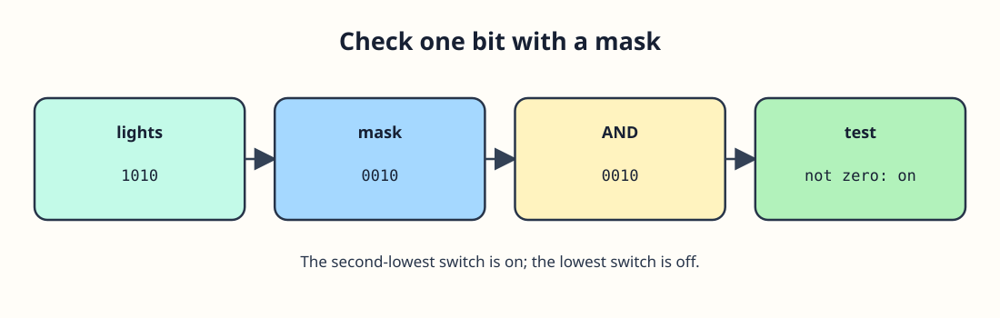

# Read one indicator bit



The workshop panel has four indicator switches. Each can be on (1) or off (0), so their states fit in the low bits of an `unsigned int`. Read the four positions from right to left: hexadecimal `0xA` represents `1010` in those bits. C11 does not use the `0b` binary-literal prefix, so the code uses hex. A mask with one set bit selects one position. Bitwise `&` keeps a 1 only where both values have a 1.

```c run
#include <stdio.h>

int main(void) {
    unsigned int lights = 0xAu;
    unsigned int repair = 0x2u;
    printf("Repair light on: %u\n", (unsigned int) ((lights & repair) != 0u));
    printf("First light on: %u\n", (unsigned int) ((lights & 0x1u) != 0u));
    return 0;
}
```
The `repair` mask checks the second bit from the right; it is on, while the lowest bit is off. Before running again, predict what changes if `lights` becomes `0xBu` (`1011`). Keep the `u` suffix on unsigned constants.
