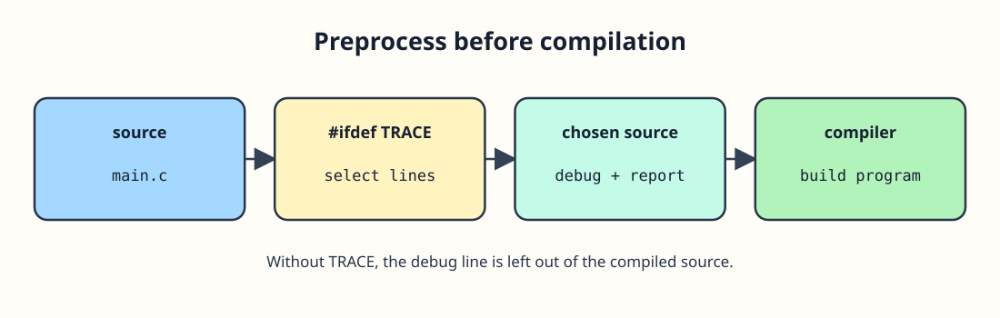

# Keep a debug line out of the normal report



The workshop report always needs its repair count. During debugging, a second line can show the value before the public report. `#ifdef TRACE` keeps the enclosed source only when `TRACE` is defined; the preprocessor makes that choice before C compilation. Here it is defined so both lines appear.

```c run
#include <stdio.h>
#define TRACE

int main(void) {
    int repairs = 4;
#ifdef TRACE
    printf("Debug count: %d\n", repairs);
#endif
    printf("Repairs: %d\n", repairs);
    return 0;
}
```

Remove `#define TRACE` and run again. `Debug count: 4` should disappear, while `Repairs: 4` stays. Restore the definition afterward. With a local compiler, you could instead pass `-DTRACE` at build time.
