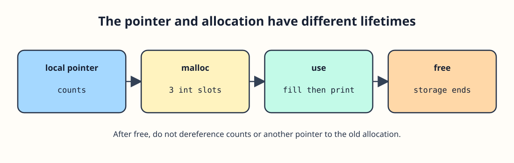

# Make room for a variable-sized count




The desk chooses how many counts to store when the program runs. `malloc` requests enough bytes for them and returns a pointer, or `NULL` on failure. The expression `sizeof *counts` measures one element without repeating its type. Because the allocated elements start without usable values, check the pointer first and initialize every element before reading it. Release the allocation with `free` after the last use.

```c run
#include <stdio.h>
#include <stdlib.h>

int main(void) {
    size_t n = 3;
    int *counts = malloc(n * sizeof *counts);
    if (counts == NULL) {
        fprintf(stderr, "Allocation failed\n");
        return 1;
    }
    for (size_t i = 0; i < n; i++) {
        counts[i] = (int) (i + 1);
    }
    printf("Total: %d\n", counts[0] + counts[1] + counts[2]);
    free(counts);
    counts = NULL;
    return 0;
}
```

No array element is read before it has a value. `counts = NULL` protects this particular variable against accidental reuse, but it cannot repair other copies of the freed address. For the exercise, repeat that order with different counts: allocate, check, fill, read, free.
